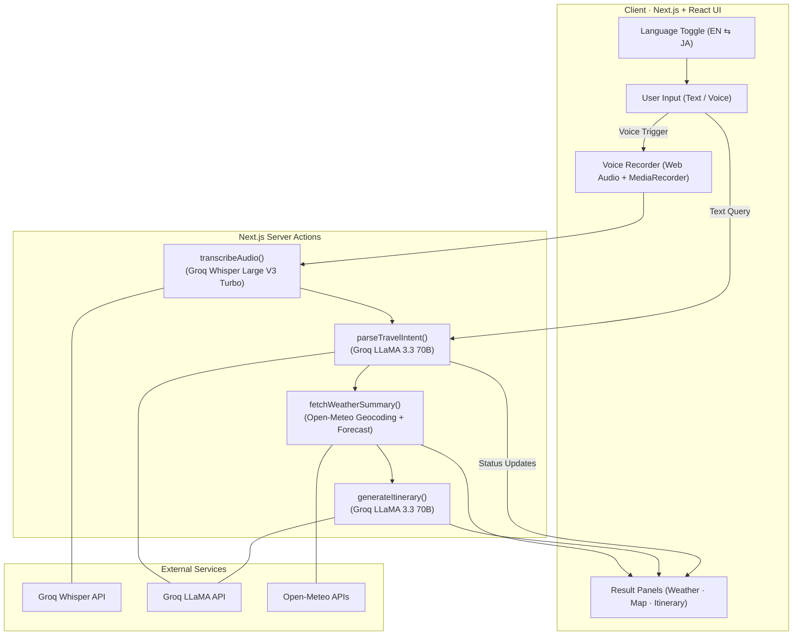

# 🇯🇵 Kibun Japan Planner (気分)

)

## 📖 Description

**English:**  
**Kibun** (Japanese for "feeling" or "mood") is an intelligent travel assistant designed specifically for Japan. It combines real-time weather data with AI-driven advice to help you decide what to wear and where to go based on your mood. Whether you are planning a climb up Mt. Fuji or a street food tour in Osaka, Kibun visualizes the location on an interactive 3D map and provides bilingual support via voice or text.

**日本語:**  
**Kibun（気分）**は、日本の旅行に特化したインテリジェントなアシスタントです。リアルタイムの気象データとAIによるアドバイスを組み合わせ、あなたの「気分」に合わせて服装や行き先を提案します。富士登山や大阪の食べ歩きなど、目的地をインタラクティブな3Dマップで視覚化し、音声またはテキストによる日英バイリンガルサポートを提供します。

---

## ✨ Key Features

**English:**
- 🎤 **Voice Input** - Speak naturally in English or Japanese using **Groq Whisper** (Large V3) for instant transcription.
- 🗺️ **Smart Mapping** - Automatically detects locations in your conversation and flies to them on a 3D **Mapbox** view.
- 🌤️ **Weather Integration** - Fetches live weather data (Temperature & Conditions) via **OpenWeatherMap** to give context-aware outfit advice.
- 🧠 **Context-Aware AI** - Powered by **Llama 3.3 70B**, the assistant remembers conversation history and creates structured travel plans.
- ⚡ **Bilingual UI** - Toggle instantly between English and Japanese modes with localized map labels and responses.

**日本語:**
- 🎤 **音声入力** - **Groq Whisper** (Large V3) を使用し、英語または日本語で自然に話しかけるだけで瞬時に文字起こしが可能です。
- 🗺️ **スマートマップ** - 会話内の場所を自動的に検出し、3D **Mapbox** 上でその場所へ移動します。
- 🌤️ **天気連携** - **OpenWeatherMap** 経由でリアルタイムの天気を取得し、天候に合わせた服装のアドバイスを提供します。
- 🧠 **文脈理解AI** - **Llama 3.3 70B** を搭載し、会話の履歴を記憶しながら、構造化された旅行プランを作成します。
- ⚡ **バイリンガルUI** - 英語と日本語のモードを瞬時に切り替え、地図のラベルや応答も言語に合わせて最適化されます。

---

## 🏗️ System Architecture

---

## 🛠️ Tech Stack

### Frontend
- **Framework:** Next.js 15+ (App Router)
- **Language:** TypeScript
- **Styling:** Tailwind CSS (v4)
- **State Management:** Zustand
- **Maps:** React Map GL (Mapbox)
- **Icons:** Lucide React

### Backend & AI
- **LLM Inference:** Groq SDK (Llama 3.3-70b-versatile)
- **Speech-to-Text:** Groq SDK (whisper-large-v3)
- **Weather Data:** OpenWeatherMap API
- **Runtime:** Node.js (Next.js Serverless Functions)

---

## 💡 Example Usage

**Scenario 1: Hiking Preparation**
> **User (Voice):** "I want to climb Mount Fuji next week. What should I wear?"
>
> **Kibun:** Fetches weather for Mt. Fuji, moves the map to coordinates `35.3606, 138.7274`, and advises on layers, boots, and rain gear based on the temperature.

**Scenario 2: City Exploration**
> **User (Text):** "大阪への旅行を計画して。" (Plan a trip to Osaka.)
>
> **Kibun:** Moves map to Osaka, switches response to Japanese, and suggests an itinerary including Dotonbori and Osaka Castle with outfit tips for the current weather.

---

## 📄 License

This project is licensed under the MIT License.
